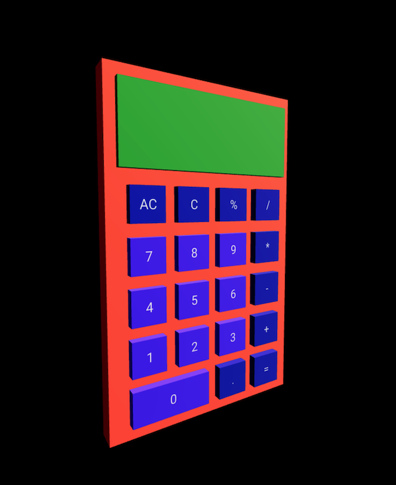

# React Three Calculator

## Table of Contents

* [Deployed Site](#deployed-site)
* [User Story](#user-story)
* [Description](#description)
* [Screenshots](#screenshots)
* [Technologies](#Technologies)

## Deployed Site
---
Deployed Website: https://react-three-calculator.herokuapp.com/

## User Story
User Story: 
- As a User, I would like to navigate to a stylish 3d calculator app. As a User, I would like to do basic arithmatic calculations with the 3d calculator. As a User, I would like to clear calculations once done. As a User, I would like to know if there is an error if illegal calculations are done and be able to clear it and start over.  

## Description
This is a calculator app made with components from the React Three Fiber. 

## Screenshots
---
Home Page

## Technologies

- React.js
- CSS
- Node.Js
- Three
- React Three Fiber
- React Three Drei
- React Three Flex
- Babel
